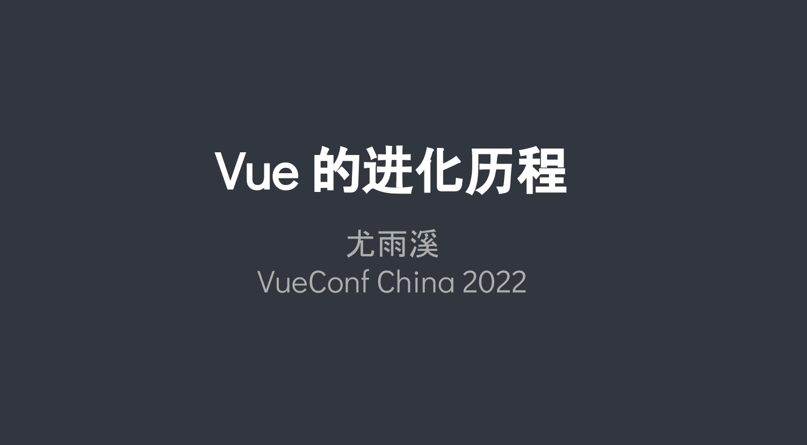

[toc]

# 实锤了，尤大妥妥的二次元迷弟 —— 聊聊 Vue 的进化历程

摘要：实锤了，尤大妥妥的二次元迷弟，尤大在 VueConf China 2022 上聊了 Vue 的进化历程，本文就以尤大的口吻来聊聊 Vue 的进化历程

先来看看 **Vue 版本发布代号**，看出什么来了吗？尤大这简直就是思路清晰的**妥妥二次元迷弟**呀。

> 尤大指尤雨溪

[Animatrix](https://github.com/vuejs/vue/releases/tag/v0.9.0)(0.9) —— 《黑客帝国动画版》

[Blade Runner](https://github.com/vuejs/vue/releases/tag/v0.10.0)(0.10) —— 《银翼杀手：2022黑暗浩劫》是渡边信一郎执导的动画短片

[Cowboy Bebop](https://github.com/vuejs/vue/releases/tag/0.11.0)(0.11) —— 《星际牛仔》是日本[SUNRISE](https://baike.baidu.com/item/SUNRISE/5352607?fromModule=lemma_inlink)动画公司制作的原创[电视动画](https://baike.baidu.com/item/电视动画/2369609?fromModule=lemma_inlink)

[Dragon Ball](https://github.com/vuejs/vue/releases/tag/0.12.0)(0.12) —— 《龙珠》是日本漫画家[鸟山明](https://baike.baidu.com/item/鸟山明/194619?fromModule=lemma_inlink)从1984年至1995年连载的少年漫画作品

[Evangelion](https://github.com/vuejs/vue/releases/tag/1.0.0)(1.0) —— 《新世纪福音战士》是由GAINAX、[龙之子工作室](https://baike.baidu.com/item/龙之子工作室/768887?fromModule=lemma_inlink)共同制作的日本动画作品

[Ghost in the Shell](https://github.com/vuejs/vue/releases/tag/v2.0.0)(2.0) —— 《攻壳机动队》是由[士郎正宗](https://baike.baidu.com/item/士郎正宗/3578439?fromModule=lemma_inlink)于1989年5月开始创作的青年漫画刊物

[Hunter X Hunter](https://github.com/vuejs/vue/releases/tag/v2.1.0)(2.1) —— 《全职猎人》是日本漫画家[富坚义博](https://baike.baidu.com/item/富坚义博/188127?fromModule=lemma_inlink)的一部漫画作品

[Initial D](https://github.com/vuejs/vue/releases/tag/v2.2.0)(2.2)  —— 《头文字D》是漫画家[重野秀一](https://baike.baidu.com/item/重野秀一/5423337?fromModule=lemma_inlink)作画的青年漫画

[JoJo's Bizarre Adventure](https://github.com/vuejs/vue/releases/tag/v2.3.0)(2.3) —— 《JOJO的奇妙冒险》是由日本漫画家[荒木飞吕彦](https://baike.baidu.com/item/荒木飞吕彦/4137982?fromModule=lemma_inlink)所著漫画

[Kill la Kill](https://github.com/vuejs/vue/releases/tag/v2.4.0)(2.4) —— 《斩服少女》是由[中岛一基](https://baike.baidu.com/item/中岛一基/54359496?fromModule=lemma_inlink)创作的热血奇幻动画

[Level E](https://github.com/vuejs/vue/releases/tag/v2.5.0)(2.5) —— 《Level E》为日本漫画家[富坚义博](https://baike.baidu.com/item/富坚义博/188127?fromModule=lemma_inlink)的科幻漫画

[Macross](https://github.com/vuejs/vue/releases/tag/v2.6.0)(2.6) —— 《超时空要塞Macross》是[龙之子工作室](https://baike.baidu.com/item/龙之子工作室/768887?fromModule=lemma_inlink)负责动画制作的原创电视动画

[Naruto](https://github.com/vuejs/vue/releases/tag/v2.7.0)(2.7) —— 漩涡鸣人，日本漫画《[火影忍者](https://baike.baidu.com/item/火影忍者/8702?fromModule=lemma_inlink)》及其衍生作品中的男主角

[One Piece](https://github.com/vuejs/core/releases/tag/v3.0.0)(3.0)  —— 《航海王》是日本漫画家[尾田荣一郎](https://baike.baidu.com/item/尾田荣一郎/579360?fromModule=lemma_inlink)作画的少年漫画作品

[Pluto](https://github.com/vuejs/core/releases/tag/v3.1.0)(3.1) —— 《Pluto》是[浦泽直树](https://baike.baidu.com/item/浦泽直树/752781?fromModule=lemma_inlink)的漫画作品

[Quintessential Quintuplets](https://github.com/vuejs/core/releases/tag/v3.2.0)(3.2) —— 《五等分的新娘》是[春场葱](https://baike.baidu.com/item/春场葱/57169679?fromModule=lemma_inlink)创作的漫画作品

是不是从这里就可以看出呀，尤大这典型的动漫小王子。我不是标题党吧，哈哈！！

**3.3 版本的代号又会是什么呢？首先肯定是 R 开头的，不妨猜猜看？？**

这里呢，我们看到了 Vue 发布的版本代号，那不仅让人想问， **Vue 到底是怎样发展至今的呢**，这里面又有哪些历程呢，我们就来聊聊吧！其实这才是本文的重点，哈哈！

  

## 1. 前言

VueConf China 2022 于 2022 年 12 月 10 日在线举办。会议中尤大为我们详述了 Vue 的整个进化历程，因此本文将以尤大的口吻来进行记录。

Vue 发展至今，有 7、8 个年头了，也是一个不年轻的项目了。Vue 接下来要怎么发展，每一步要怎样走，都需要慎重考虑，因此，适当的回头看看，看 Vue 是怎么发展到今天的这个形态的。

这样既能够为之后的发展提供思路和想法，同时对于新用户或者不了解 Vue 的同学，也可以对 Vue 的历程有一个完整的了解，帮助更好的理解设计上的决定是怎么来的。

## 2. 库阶段

> Library Phase(Pre 1.0) 
> 2013 - 2015

首先解释一下个人对库和框架区别的理解：

- 库：是直接嵌入到已有的体系中去，很简单的进行使用，对于这个体系是没有影响的
- 框架：是会定义一套更加广泛的工程实践，会希望使用者去遵循一定的最佳实践或者相应的配套工具，遵循一套完成的规范

### 2.1 阶段发展

当时的 Vue 还是库的阶段，整个的发展如下：

- 2013.12 - 第一个以 “Vue.js” 命名的版本 (0.6.0)

  在这之前叫 （Seed）

- 2014.02 - 第一次在 [HackerNews](https://news.ycombinator.com/item?id=7169288) 上公开发布

  在  [HackerNews](https://news.ycombinator.com/item?id=7169288) 上发布后，开始获得了 400 多的 github start

  > HackerNews 是国外相当牛的科技圈社区，在科技与创业圈里面非常有名，尤其如果你想混北美和欧洲的圈子的话，HN 是你绕不开的一个社区和渠道

- 2014.10 - 第一次实现 Vue SFC 单文件组件 (vueify)

  基于 [Browserify](https://github.com/browserify/browserify) 打包工具的插件

  > Browserify 是一个相当古老的打包工具了，新同学应该都没听说过的，感兴趣的可以自行搜索

- 2014.11 - 第一次完全重写 (0.11)

  在这之前，都是属于业余，比较玩票性质的。0.11 版本，正经地开始写这个项目，认真地思考如何做好它

### 2.2 设计重点和特征

1. 库阶段的设计重点

   - 基于 ES5 `getter/setters` 和原生 JS 对象的响应式系统

     在当时，IE8 以下甚至 IE6 的支持都有广泛的需求，而 `getter/setters` 是需要浏览器原生支持（没有一个很好的办法去 hack 它），所以其实当时是用这个来实现响应式还是存在一定风险的。

     不过当时并不在意，因为这并不是个问题，反正当时用的人也不多，就没想着去兼容 IE8  以下了。先基于这个想法（乐趣）去实现了。

     > 其实这个思路是可以借鉴的，做工程或项目的时候，在一开始不用非得要去想着兼容所有的，先做出来，然后再优化，这是可行的

   - MVVM / 模版数据绑定

     Model-View-ViewModel 最早由 [Knockout.js](https://github.com/knockout/knockout) 提出的理念。其实现在我们不太用这个词了，因为我们发现把现在的框架去硬套一个模式并没有太大的意义了

   - 像 jQuery 一样可以直接通过`<script>`引用的简单库

     也是唯一支持的用法，这就是典型的库，并不会对你的应用造成入侵或者限制，比如是否使用打包工具，**主要是提供了数据驱动的开发体验**，这也是 Vue 在当时、在那个阶段能够获得初始用户的主要原因吧。

2. 库阶段的特征

   - （还）不算是个框架 

   - 受 Backbone / Ractive 影响的 API: 

     [Backbone](https://github.com/jashkenas/backbone) / [Ractive](https://github.com/ractivejs/ractive) 是 Sevlte 的前身

     - 响应式系统和组件实例有很强的耦合，影响逻辑复用 

       所有的响应式都是在 `this` 上操作来实现的，好处是比较容易理解、直观、比较符合基于 class 的 api，坏处就是很难实现逻辑复用

       > 其实这个在 options API 中依旧存在的，直到 vue3 才解决，将响应式系统和组件实例进行了分离

     - 直到 0.11 才引入 Mixins

       Mixins 仍然存在很多的问题，所以后来就弃用了。

   - 还在摸索完善模版语法和作用域规则

   - 基于 DOM 的渲染机制

     - 没有 “编译” 过程

       > 没有编译我是没想到的

     - 模版直接实例化为 DOM 树

     - 通过遍历 DOM 树实现数据绑定

     - 类似现在 petite-vue 的实现

       petite-vue 是在 Vue3 之后，对 vue1 的重新实现（新的展现），更加轻量级的重写，将 vue1 的机制用更现代的方式呈现出来。petite-vue 适用于更加轻量化，不需要那么多工程实践的场景。

## 3. 框架阶段

> Framework Phase (1.x)
>
> 2015-2016

### 3.1 阶段发展

- 2015.08 - 第一版 Vue Router 发布

- 2015.09 - 开始开发 1.0

  基于 0.11 12 来写的，主要是设计上的改动，更多的是将模板语法彻底的完善

- 2015.10.26 - 1.0 “Evangelion” 发布

  > *evangelion* 《新世纪福音战士》 文章开头提到了

- 2015.12 - 第一版 vue-cli 发布

  和现在的  vue-cli 根本不是一个量级的，更多的是一个拉取模板的工具。但此时也算是慢慢地引入工程化了

- 2016.03 - 第一版 Vuex 发布

### 3.2 设计重点

框架阶段的设计重点

- 稳定模版语法和作用域设计

  - 确定了 v-bind, v-on 和对应简写的语法
  - 第一次引入 v-for (取代了 v-repeat)

  在 1.0 之前基本上每一个小版本 api 变化都比较大的，后面才慢慢地稳定下来

- 将项目的涵盖范畴扩大到 SPA 框架

  - SPA 路由
  - 状态管理
  - 工具链
    - 热更新
    - Scoped CSS

## 4. 通用框架阶段

> Universal Framework Phase (2.x)
>
> 2016-2019

### 4.1 阶段发展

- 2016.03 - 第一次明确提出 “渐进式框架” 的概念

- 2016.04 - 开始开发 2.0

  从 Meteor Development Group 离职，开始全职开发这个项目

- 2016.10.01 - 2.0 “Ghost in the Shell” 发布

  > *Ghost In The Shell* 《攻壳机动队》

- 2016.11 - 2.1 “Hunter X Hunter” - 作用域插槽

  > Hunter X Hunter《全职猎人》

- 2017.02 - 2.2 “Initial D” - SSR 支持基于路由的代码分割

  > *Initial D* 《头文字D》

- 2017.04 - 2.3 “JoJo” - SSR 支持基于路由的资源预加载

  > 《JOJO 的奇妙冒险》

  实现 Bundle Rendering，对 Webpack 打包出来的信息进行分析，通过 Webpack 打包生成的 manifest 文件，来分析每一个路由（代码块）中用到了哪些源码模块，来实现资源的预加载

- 2017.06 - 2.4 “Kill la Kill” - SSR 完整异步组件支持 + 部分优化的 SSR 编译输出

  > *KILL la KILL* 《斩服少女》

  SSR 的实现过程是：将模板编译成  Virtual DOM 渲染函数 -> 生成 Virtual DOM -> Virtual DOM 字符串化 HTML，这个过程是比较昂贵的。

  在这里做的部分优化是让静态的部分跳过这个过程，在编译时，分析出静态部分，这部分直接使用字符串，这样一部分是字符串一部分是 Virtual DOM，优化了部分的开销。

  这样做虽然优化了部分开销，但还是不能完全地抵消 Virtual DOM 在服务端渲染中的代价，现在的 Vue3 中做到了

- 2018.01-08 - Vue CLI 3.0

  - 针对 SPA 的高度集成工具链

  - 进一步拓展框架的边界

    - “工具链也是框架的一部分”（当时的想法，回头看是有问题的）

      当时想的是想要尽可能为用户多做一些事情，现在回头看是有些问题的。因为前端工具链体系发展是很快的，而且工具链都是跨框架的，所以试图将所有的工具链都吃在框架的范畴里其实有不太现实的，这样增加了很大的维护成本。而且当社区工具链发生变化时，也需要做出相应的调整，维护成本很大。Vite 就很好的解决了这个问题。

### 4.2 设计重点

2.0 阶段的设计重点

- 第二次彻底重写，代码架构改进

- 引入了将模版编译为 Virtual DOM 渲染函数的编译流程

  开始有了模板编译，编译为 Virtual DOM 渲染函数，当时只有这一种编译策略

- 基于 Virtual DOM 的服务端渲染 (SSR)

    编译成  Virtual DOM 渲染函数 -> 生成 Virtual DOM -> Virtual DOM 字符串化 HTML
    > 与 React 的服务端渲染是一模一样的

- 基于 Virtual DOM 的跨端渲染 (Weex, NativeScript)

- 和类型系统的结合

  - 源码中使用 Flow

    现在来看，事后诸葛亮，确实选错了。也是因为当时 TypeScript 的优势不如 Flow

  - 手动 TypeScript 类型定义

### 4.3 典型案例

在社区提供了一个经典的 demo，[vue-hackernews-2.0](https://github.com/vuejs/vue-hackernews-2.0)

- webpack + SFC + Vue Router + Vuex + SSR 
- 第一个完整展示 Vue 2 SSR 架构的 demo
- Vue 2 SSR 相关功能的测试平台
- 启发了上层 SSR 框架如 Nuxt

## 5. 编译/运行时混合阶段

> Compiler/Runtime Hybrid Phase (3.x)

2.x 虽然也引入了编译，但是 2.x 的编译和运行时之间的结合是非常浅的，也就是说编译器编译出  Virtual DOM 渲染函数后就到此为止了，编译器对于运行时是怎么样的其实是没有太多的概念，运行时对于编译器也是没有概念的。虽然两边分得比较开，很独立，但相应的可优化的空间其实也浪费掉了。

但，编译器和运行时本身都是框架的一部分，他们本身就是耦合的，在这个耦合的前提下，可以想办法让编译器为运行时提供更多的信息，让运行时知道编译器会提供这些信息。在这样的前提下，就可以做很多的优化，这其实也是很多框架的趋势，React 是唯一一个没有走这个方向的框架。但其实 React 的上层框架，比如 Nextjs 、[React Forget](https://www.youtube.com/watch?v=lGEMwh32soc)，最终也是慢慢地在走这个方向。其它的框架，比如 Sevlte Solid.js 都是编译运行混合的方案。

> React Forget 大家可能不是很熟悉，这是 React Conf 2021 由 Xuan Huang 大神介绍的可以自动添加 React.memo 的神奇之物

### 5.1 阶段发展

- 2018.09 - 在 Vue.js London 远程宣布 Vue 3 开发计划

  vue3 八字还没有一撇的时候

- 2018.09 - 2019.05 - 调研阶段

- 2019.05 - 基于编译优化 VDOM 性能的新策略

  编译时和运行时的整合，比如 blockTree，patchFlag（位运算进行节点更新）

  > 这些名词大家可能不是很清楚，可以简单地理解为编译的时候打了很多标记和整合，这样运行时拿到这些信息就可以做对应的处理

- 2019.08 - Composition API RFC

  最开始还讨论过基于 Class 的 API，由于 Class API 对于 ES 的 Decorator（装饰器）有很强的依赖，没有 Decorator 的话没有办法提供很好的开发体验，而当时的 Decorator 还处于 Stage2，而且还经过了好几次的重写修改，完全不知道之后会经历怎么样的改写和发展，也不确定是否会成为标准，所以不敢冒这么大的风险去基于一个不知道会怎么样发展的提案上面，所以这也是转向基于函数组合来实现 API 思路的一个契机

  Composition API 的意义

  - Vue 的用例越来越多进入企业、大型项目领域

  - Options API 在可扩展性方面有明显上限

  - 对类型系统更友好

    当时为了 Options API 的类型支持，其实在内部做了很复杂的类型体操，甚至当时 TypeScript 团队在某种程度上是为了支持 Vue2 的类型推导才推出了 `ThisType`。函数式对于类型相当顺滑

  - 提供灵活且可维护的逻辑组合/复用

- 2020.01 - 3.0 alpha

- 2020.04 - 3.0 beta - 完全优化的 SSR 编译输出

  vue2 是部分，vue3 是完全优化，能做成字符串拼接的都做了字符串拼接

- 2020.04 - 2021.02 - 绕道开发了 Vite

  Vite 的意义

  - 大幅优化开发体验

  - 将和框架没有耦合的工具链职责剥离，交给一个更大的社区去维护

    Vite 在 Vue 之外的生态中也有被广泛的使用，成为了一个共享的工具，所以获得了非常活跃的社区，包括来自 Sevlet, React 社区

  - 缩减 Vue 本身的框架范畴和维护负担

    -  Vue CLI -> create-vue

      整合时不再是用和 Vue 强耦合的东西来整合了，第三方工具的整合是使用 Vite 来整合了

- 2020.09 - 3.0 ”One Piece“ - 稳定版发布

  > One Piece  《海贼王》

  仅仅是核心功能的稳定版本

- 2021.06 - 3.1 Migration Build

  可以兼容 vue2 的语法，可以更好的方便 vue2 用户的升级

- 2021.08 - 3.2 `<script setup>` 

  到此，组合式 API 使用才比较舒服

- 2022.01 - Vue 3 切换为默认版本

  将 vue3 切换为默认版本

- 2022.02 - 全新的 Vue 3 文档

### 5.2 设计重点

3.x 重构初期的重心

- 提高浏览器最低支持要求，使用现代 ES 语法和功能

- 全面提升性能 

- 改善类型系统整合

- 改善在大型应用中的可扩展性

  Vue2 大部分应用在中小型应用中，渐渐在大应用中使用了

一开始的想法是先发布需要 ES2015 环境的版本，然后再适配 IE 等，但发现后来，IE 的需求越来越低了，所以就彻底去掉了，后来微软都宣布不再对 IE 进行维护了， 所以也是一个比较好的时机

> 这算是有先见之明吗？无敌

### 5.3 框架范畴

Vue 3 目前所定义的框架范畴

- 核心（运行时 + 编译器）

- 文档 

- 工具链 (create-vue) 

- SPA 路由 (Vue Router) 

- 状态管理 (Pinia) 

- 浏览器开发工具 (vue-devtools) 

- IDE 支持 (Volar) 

  模板类型推导

- TypeScript 支持 (vue-tsc) 

  在 tsc 上包裹一层 vue-tsc，这样同时可以检测普通的 ts 文件和 vue 的 SFC

- 静态分析 (eslint-plugin-vue) 

- 单元测试 (@vue/test-utils)

## 6. 现状、趋势和展望

### 6.1 现状

- 社区仍然处于 2 -> 3 的过渡阶段

- 2022 年 6 月发布的 2.7，进一步弥补 2 和 3 之间的断层(backport)

- 基于目前的 npm 数据:

  - 超过 30% 的项目在使用 Vue 3

  - 大约 25% 在用 2.7

    如果不升级也是可以的，vue2 也是非常稳定的产品的

  - 超过一半的项目可以使用 Composition API 和 `<script setup>`

### 6.2 趋势

向编译/运行时混合模式进化

- 同一份模版，不同的编译输出

  - 浏览器: 高度优化的 Virtual DOM 渲染函数

  - SSR: buffer + 字符串拼接

    将字符串push 到一个 buffer 中，这样来支持异步

  - 将来: Vapor mode (无 Virtual DOM 的渲染代码)

    把模板编译成不依赖 Virtual DOM 的渲染代码来获得更好的性能

- 单文件组件语法糖

  - `<script setup>`

  - `CSS v-bind()`

  - `Reactivity Transform`

    > 暂未完全实现，还在实验阶段

  - `vue macros`

    > 后面文章将会讲到，这里先预留

### 6.3 展望

- 接下来的阶段将以 API 稳定性为优先

- 重点会放在不影响使用方式的改进上

- 不计划引入类似 React Server Components 的需要和服务器强绑定的特性

- 短期

  - Reactivity Transform / Suspense 稳定化

  - SSR 水合改进 (lazy / on-demand / server-only)

    3.3 版本会实现（懒水合，按需水合）

- 中到长期

  Vapor mode (受 Solid 启发的模版编译策略)

  - 完全一样的模版/组件语法
  - 输出不再依赖 Virtual DOM 运行时
  - 极致的性能和内存占用
  - 零成本组件抽象
  - 无缝嵌入在现有应用中（兼容所有基于 VDOM 的第三方库）
  - 或者: 启用 Vapor-only (不兼容 VDOM) 
  - 明年公布更多信息

