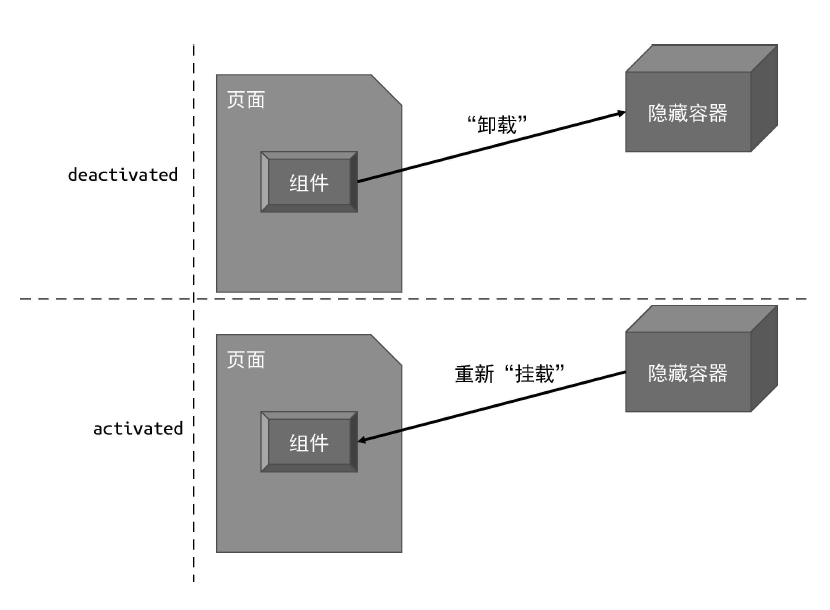

# 14 内建组件和模块

## 14.1 KeepAlive 组件的实现原理

KeepAlive 借鉴于 HTTP 协议，HTTP 中的 KeepAlive 可以避免连接频繁地销毁/创建，与之类似，Vue 中 KeepAlive 组件可以避免组件被频繁地销毁/创建。

```vue
<template>
  <Tab v-if="currentTab === 1">...</Tab>
  <Tab v-if="currentTab === 2">...</Tab>
  <Tab v-if="currentTab === 3">...</Tab>
</template>
```

单纯地这样写，每次切换的时候组件都会被销毁和创建，因此可以用 KeepAlive 组件来解决这个问题：

```vue
<template>
  <KeepAlive>
    <Tab v-if="currentTab === 1">...</Tab>
    <Tab v-if="currentTab === 2">...</Tab>
    <Tab v-if="currentTab === 3">...</Tab>
  </KeepAlive>
</template>
```

KeepAlive 的本质是缓存管理，再加上特殊的挂载/卸载逻辑。
- 缓存管理：将组件实例缓存起来
- 挂载：如果没有缓存，那么直接挂载并缓存起来；如果已经缓存过了，那么使用缓存的组件实例来挂载，挂载也不是实际真正的挂载，而是从一个虚拟的节点下移动到要挂载的节点下
- 卸载：并不是真正地执行卸载，而是将组件实例从当前父节点下移动到一个虚拟节点下，这样，下次挂载就是从这个虚拟节点获取了

可以看到，KeepAlive 组件的实现是需要渲染器层面的支持。这是因为被 KeepAlive 的组件在卸载时，并不是真的将其卸载，否则就无法维持组件的当前状态了。正确的做法是，将被 KeepAlive 的组件从原容器搬
运到另外一个隐藏的容器中，实现“假卸载”。当被搬运到隐藏容器中的组件需要再次被“挂载”时，也不是执行真正的挂载逻辑，而是把该组件从隐藏容器中再搬运到原容器。这个过程对应到组件的生
命周期，其实就是 activated 和 deactivated（激活和失效）。



```js
/** KeepAlive 组件 */
const KeepAlive = {
  name: 'KeepAlive',
  // KeepAlive 组件独有的属性，用作标识
  _isKeepAlive: true,
  setup(props, { slots }) {
    // 缓存，用于缓存组件 vnode
    const cache = new Map();
    // 当前 KeepAlive 组件的实例
    const instance = currentInstance;
    // 对于 KeepAlive 组件组件来说，它的实例上存在特殊的 keepAliveCtx 对象，该对象由渲染器注入
    // 该对象会暴露渲染器的一些内容方法，其中 move 函数用来将一段 DOM 移动到另一个容器中
    const { move, createElement } = instance.keepAliveCtx;
    // 创建隐藏容器
    const storageContainer = createElement('div');

    // KeepAlive 组件的实例上会被添加两个内部函数，分别是 _deActivate 和 _activate
    // 这两个函数会在渲染器中被调用
    instance._deActivate = (vnode) => {
      move(vnode, storageContainer);
    }
    instance._activate = (vnode, container, anchor) => {
      move(vnode, container, anchor);
    }

    return () => {
      // KeepAlive 的默认插槽就是要被 KeepAlive 的组件
      let rawVNode = slots.default();
      // 如果不是组件，直接渲染即可，因为非组件的虚拟节点无法被 KeepAlive
      if(!isObject(rawVNode.type)) {
        return rawVNode;
      }

      // 在挂载时先获取缓存的组件 vnode
      const cachedVNode = cache.get(rawVNode.type);
      if(cachedVNode) {
        // 如果有缓存的内容，则说明不应该执行挂载，而应该执行激活
        // 继承组件实例
        rawVNode.component = rawComp.component;
        // 在 vnode 上添加 keptAlive 属性，标记为 true，避免渲染器重新挂载它
        rawVNode.keptAlive = true;
      } else {
        // 如果没有缓存，则将其添加到缓存中，这样下次激活组件时就不会执行新的挂载动作了
        cache.set(rawVNode.type, rawVNode)
      }
      // 在组件 vnode 上添加 shouldKeepAlive 属性，并标记为 true，避免渲染器真的将组件卸载
      rawVNode.shouldKeepAlive = true;
      // 将 KeepAlive 组件的示例也添加到 vnode 上，以便在渲染器中访问
      rawVNode.keepAliveInstance = instance;

      // 渲染组件 vnode
      return rawVNode;
    }
  }
}
```

实现过程非常有意思，值得一看。

然后是渲染器的支持：

```js
/**
 * 卸载操作
 * @param {*} vnode 
 */
function unmountElement(vnode) {
  // 卸载时，如果卸载的 vnode 类型是 Fragment，那么需要卸载的是它的所有子节点
  if (vnode.type === Fragment) {
    vnode.children.forEach(child => unmountElement(child))
    return
  } else if(isObject(vnode.type)) {
    if(vnode.shouldKeepAlive) {
      // 对于需要被 KeepAlive 的组件，我们不应该真的卸载它，而是应该调用该组件的父组件
      // 即 KeepAlive 组件的 _deActivate 函数使起失活
      vnode.keepAliveInstance._deActivate(vnode)
    } else {
      // 对于组件的卸载，本质上是要卸载组件所渲染的内容，即 subTree
      unmountElement(vnode.component.subTree)
    }
  }
  // ...
}
```

```js
/**
 * 打补丁函数
 * @param {*} n1 旧 vnode
 * @param {*} n2 新 vnode
 * @param {*} container 容器
 */
function patch(n1, n2, container, anchor) {
  // ...
  else if(isObject(type) || isFunction(type)) {
    // 如果 n2.type 的值的类型是对象，则描述的是有状态组件
    // 如果 n2.type 的值的类型是对象，则描述的是函数式组件
    if(!n1) {
      if(n2.keptAlive) {
        // 如果该组件已经被 KeepAlive，则不会重新挂载它，而是会调用 _activate 来激活它
        n2.keepAliveInstance._activate(n2, container, anchor);
      } else {
        mountComponent(n2, container, anchor)
      }
    } else {
      patchComponent(n1, n2, anchor);
    }
  }
}
```

```js
/**
 * 挂载组件
 * @param {*} vnode 
 * @param {*} container 
 * @param {*} anchor 
 */
function mountComponent(vnode, container, anchor) {
  // ...
  // 定义组件实例，一个组件实例本质上就是一个对象，它包含与组件有关的状态信息
  const instance = {
    // 组件自身的状态数据，即 data
    state,
    // 将解析出的 props 数据包装为 shallowReactive 并定义到组件的实例上
    props: shallowReactive(props),
    // 一个布尔值，用来表示组件是否已经被挂载，初始值为 false
    isMounted: false,
    // 组件所渲染的内容，即子树
    subTree: null,
    slots,
    mounted: [],
    // 只有 KeepAlive 组件的实例下会有 keepAliveCtx 属性
    keepAliveCtx: null,
  };

  // 检查当前组件是否是 KeepAlive 组件
  const isKeepAlive = vnode.type._isKeepAlive;
  if(isKeepAlive) {
    // 在 KeepAlive 组件实例上添加 keepAliveCtx 对象
    instance.keepAliveCtx = {
      // move 函数用来移动一段 vnode
      move(vnode, container, anchor){
        // 本质上是将组件渲染的内容移动到指定容器中，即隐藏容器中
        insert(vnode.component.subTree.el, container, anchor)
      },
      createElement,
    }
  }
  // ...
}
```

### 14.1.2 include 和 exclude
默认情况下会缓存所有的的“内部组件”。但有时候期望只缓存特定组件。所以需要支持 include 和 exclude。

为了简化问题，这里设定 include 和 exclude 仅支持正则类型的值。

```js
/** KeepAlive 组件 */
const KeepAlive = {
  name: 'KeepAlive',
  // KeepAlive 组件独有的属性，用作标识
  _isKeepAlive: true,
  props: {
    include: RegExp,
    exclude: RegExp,
  },
  setup(props, { slots }) {
    // ...

    return () => {
      // KeepAlive 的默认插槽就是要被 KeepAlive 的组件
      let rawVNode = slots.default();
      // 如果不是组件，直接渲染即可，因为非组件的虚拟节点无法被 KeepAlive
      if(!isObject(rawVNode.type)) {
        return rawVNode;
      }
      // 获取“内部组件”的 name
      const name = rawVNode.type.name;
      if(
        name &&
        (
          // 如果 name 无法被 include 匹配
          (props.include && !props.include.test(name)) ||
          // 或者被 exclude 匹配，说明不希望被缓存
          (props.exclude && props.exclude.test(name))
        )
      ) {
        // 则直接渲染 “内部组件”
        return rawVNode;
      }

      // ...
    }
  }
}
```

这里简化了问题哈，仅仅只是支持了正则类型的 include 和 exclude。实际上可以支持任意的匹配能力。另外，在匹配时，也可以不限于 “内部组件” 的名称，甚至可以让用户自行指定匹配要素。

### 14.1.3 缓存管理

> 最多缓存多少呢？

在 KeepAlive 组件中，使用 Map 来存储了组件 vnode 对象。如果无限制地缓存下去的话，可能会内存溢出，所以需要管理缓存——即当超出某个阈值时，应该对缓存进行修剪，但应该如何修剪呢？

vue 当前采用的修剪策略是“最新一次访问”。举例如下，假设设定 KeepAlive 组件的最大缓存容量为 2，现在有三个组件 Comp1、Comp2、Comp3：
- 初始渲染了 Comp1 并缓存起来，[Comp1]
- 切换 Comp2，[Comp1, Comp2]
- 切换 Comp3，此时最新一次访问的是 Comp2，所以 Comp2 是安全的，修剪 Comp1，[Comp2, Comp3]

另一种
- 初始渲染了 Comp1 并缓存起来，[Comp1]
- 切换 Comp2，[Comp1, Comp2]
- 切换 Comp1，[Comp1, Comp2]
- 切换 Comp3，此时最新一次访问的是 Comp1，所以 Comp1 是安全的，修剪 Comp2，[Comp1, Comp3]

至于策略如何实现，这就是一个算法问题了，后续来补充一下。

当然也可以开放接口给用户让用户自定义缓存策略。